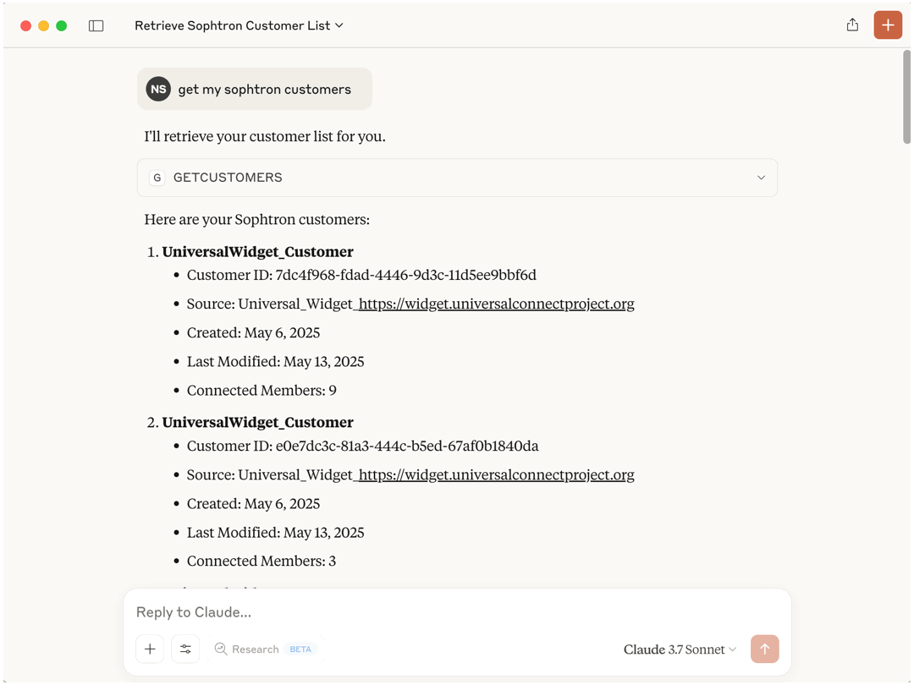

# Sophtron MCP Server

A Model Context Protocol (MCP) server implementation that integrates with Sophtron to connect to the user's bank, credit card, loan, investment or utility accounts. This server provides a structured API to retrieve current status of connected financial accounts, including account balances, transactions, or due date to the AI Agent securely.
<p align="center" width="100%">
   
</p>


## Setup

### Usage with Claude Desktop
To use this with Claude Desktop, add the following to your `claude_desktop_config.json`:

#### NPX

```json
{
  "mcpServers": {
    "sophtron": {
      "command": "npx",
      "args": [
        "-y",
        "@sophtron/server-sophtron"
      ],
      "env": {
        "SOPHTRON_USER_ID": "<YOUR_USER_ID>",
        "SOPHTRON_ACCESS_KEY": "<YOUR_ACCESS_KEY>"
      }
    }
  }
}
```

